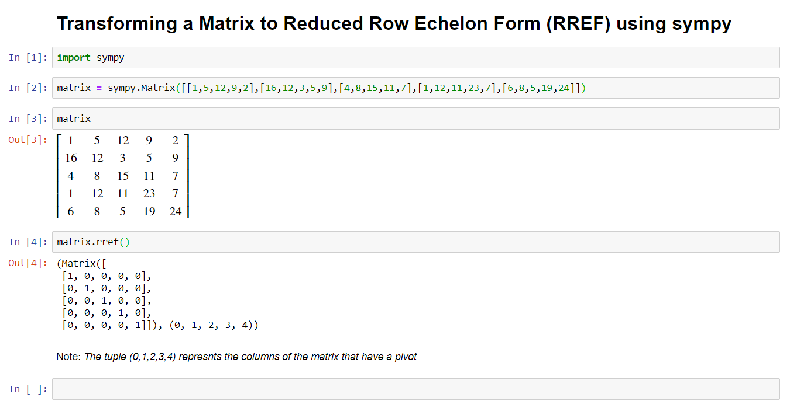

# Linear Algebra

Linear Algebra is used extensivelly in Data Science, Machine Learning and Deep Learning. Below, a few basic concepts are mentioned:

## Linear Equations

A system of linear equations, can be represented by using a matrix. 

For example, the linear equations

3x + 5y = 12
2x - 7y = 15

ca be represented by the matris

A = [[3,  5, 12],
     [2, -7, 15]]

This matrix, which contains both the coeffients of the unknowns and the constants of the equations, is called "Augmented Matrix"

To investigate if there are solutions for this system, and to find the solutions, we need to simplify this "Augmented Matrix" to a form called "RREF" (Reduced Row Echelon Form).

This simplified form, provides all the nessecary information needed to solve the system of linear equations, provided of course that a solution exists.

In terms of coding, the process to transform a matrix to the Reduced Row Echelon Form can be easily accoplished by using the Python library sympy (Symbolic Python).

The following code, shows how to accomplish this using a jupyter Notebook.

